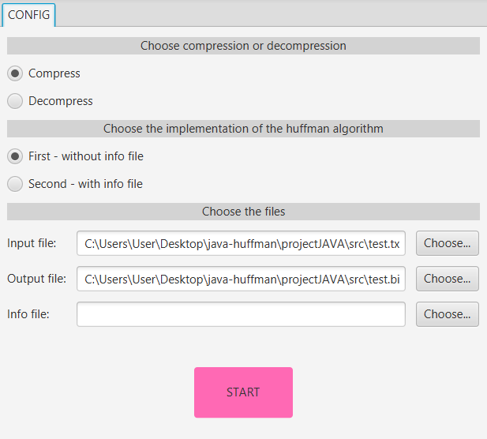
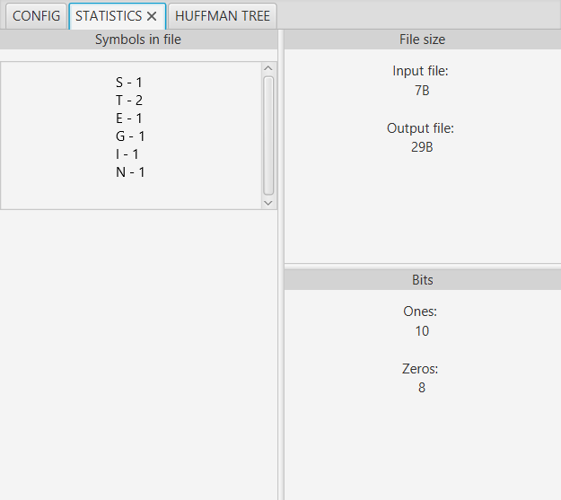
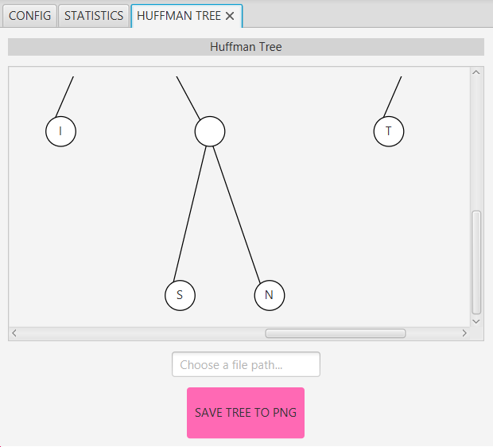
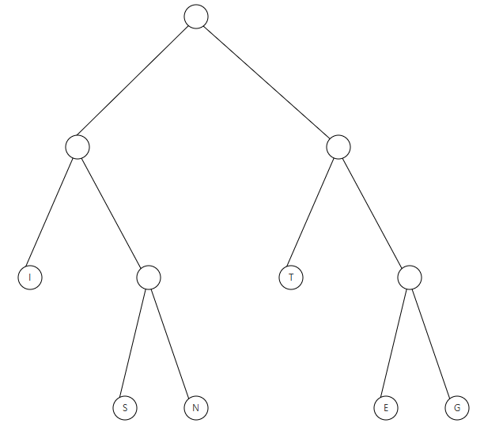
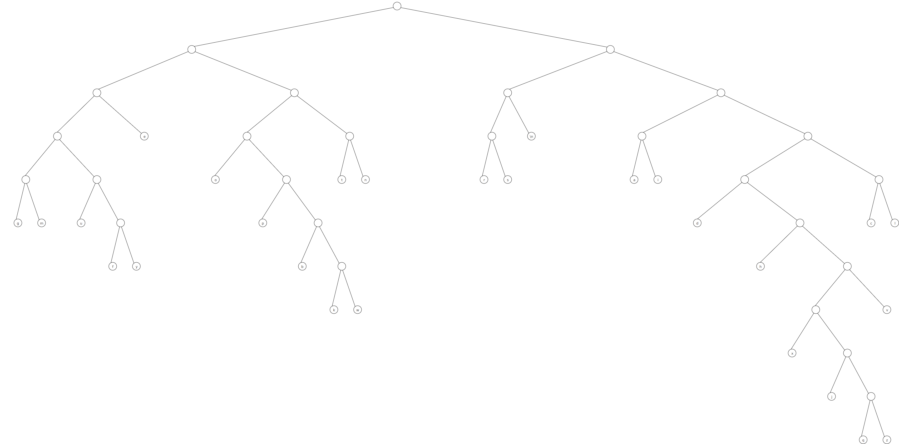

# Binary Tree Visualizator

This project is a JavaFX-based application that implements Huffman coding for file compression and decompression. It supports two different implementation strategies, generates compression statistics, and visualizes Huffman trees.

## Features
- **Compression**: Supports both compression and decompression of files using Huffman coding. There's two different executable files written in C, which are implementations of the Huffman algorithm. The first one stores the tree in the compressed file, the second one uses an info file to store the codes.
- **Decompression**: Restores original files from compressed binaries, not using the C executables,  implemented in Java.
- **Huffman tree visualization**:  Renders the Huffman tree used for encoding/decoding and allows saving it as a PNG image.  
- **Statistics generation**:  Displays character frequency, bit counts, and file sizes.  
- **JUnit automated tests**


## Building the project
You can simply use the jar file *target\javafx-app-1.0-SNAPSHOT-jar-with-dependencies.jar*
or run it like so:
```bash
mvn clean package
```
```bash
java -jar target/javafx-app-1.0-SNAPSHOT-jar-with-dependencies.jar
```

## Preview
##### GUI


##### Compression statistics


##### Binary tree visualization


##### Binary tree for the word *TESTING* after saving it to a file


##### Example of a generated binary tree for a large file

